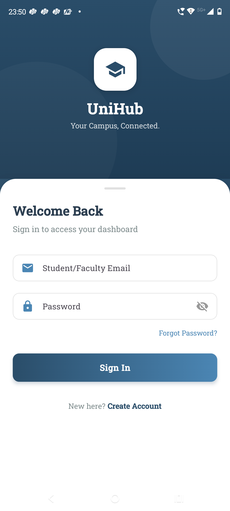
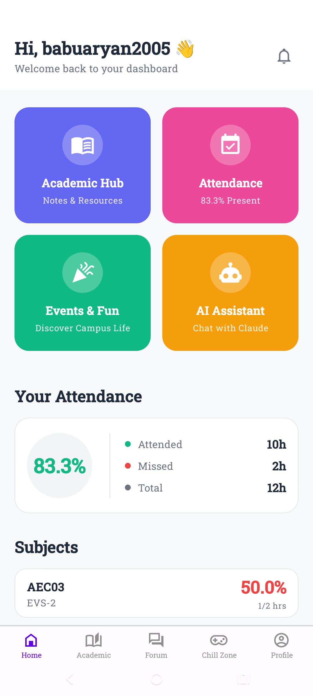
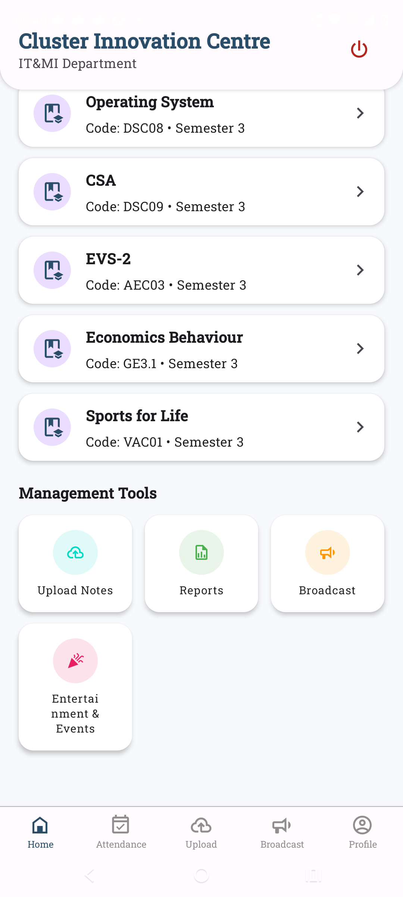

# 🎓 UniHub: All-in-One Campus Companion


> **Status:** Active Development 🚀  
> **Tech Stack:** React Native (Expo), Firebase, Node.js

##  Overview
**UniHub** is a comprehensive mobile ecosystem designed to bridge the gap between academic rigor and student life. It replaces fragmented tools (WhatsApp, ERP portals, PDFs) with a single, intelligent platform.

Built to solve the "Fragmented Academic Experience," UniHub unifies **Smart Attendance**, **Real-time Analytics**, and **Campus Community** into one seamless interface.

---

##  App Interface
*(A visual walkthrough of the user experience)*

| **Login & Onboarding** | **Student Dashboard** |
|:---:|:---:|
|  |  |
| *Secure Role-Based Entry* | *Real-time Attendance Analytics* |

| **Faculty Tools** | **Profile & Menu** |
|:---:|:---:|
|  |  |
| *Offline-First Attendance Marking* | *User Management* |

---

##  Key Features

###  For Students
* **Smart Dashboard:** Visual "Hero Charts" for immediate attendance health checks.
* **Academic Hub:** Centralized repository for Notes, PYQs, and Syllabus.
* **Chill Zone:** Integrated entertainment hub for mental well-being and campus events.

###  For Faculty
* **Digital Attendance:** Mark credit-based attendance (hourly/session-wise) with **Offline Mode** support.
* **Broadcast System:** One-tap announcements to specific batches/sections.
* **Automated Reports:** Generate and export CSV attendance sheets instantly.

---

##  Technical Architecture

This project utilizes a modern, scalable stack:

* **Frontend:** React Native (Expo) for cross-platform performance.
* **Backend:** Firebase Firestore (NoSQL) for real-time data syncing.
* **Auth:** Firebase Authentication (Secure Email/Password).
* **Offline Logic:** Local caching strategies to support low-connectivity zones.
* **Visualization:** `react-native-chart-kit` for analytics graphs.
* **File I/O:** `expo-file-system` & `expo-sharing` for generating CSV reports.

---

##  Installation & Setup

1.  **Clone the Repository**
    ```bash
    git clone [https://github.com/YOUR_USERNAME/UniHub.git](https://github.com/YOUR_USERNAME/UniHub.git)
    cd UniHub
    ```

2.  **Install Dependencies**
    ```bash
    npm install
    ```

3.  **Configure Firebase**
    * Create a project on [Firebase Console](https://console.firebase.google.com/).
    * Add your `google-services.json` (Android) to the root directory.
    * Enable **Firestore**, **Authentication**, and **Storage**.

4.  **Run the App**
    ```bash
    npx expo start
    ```

---

##  Future Roadmap
* **AI Integration:** Predictive models for attendance trends.
* **Gamification:** Badges and leaderboards for academic consistency.
* **Alumni Connect:** Networking module for mentorship.

---

##  Contributor
* **Aryan Babu**
* *Mentor: Dr. Harendra Pal Singh*